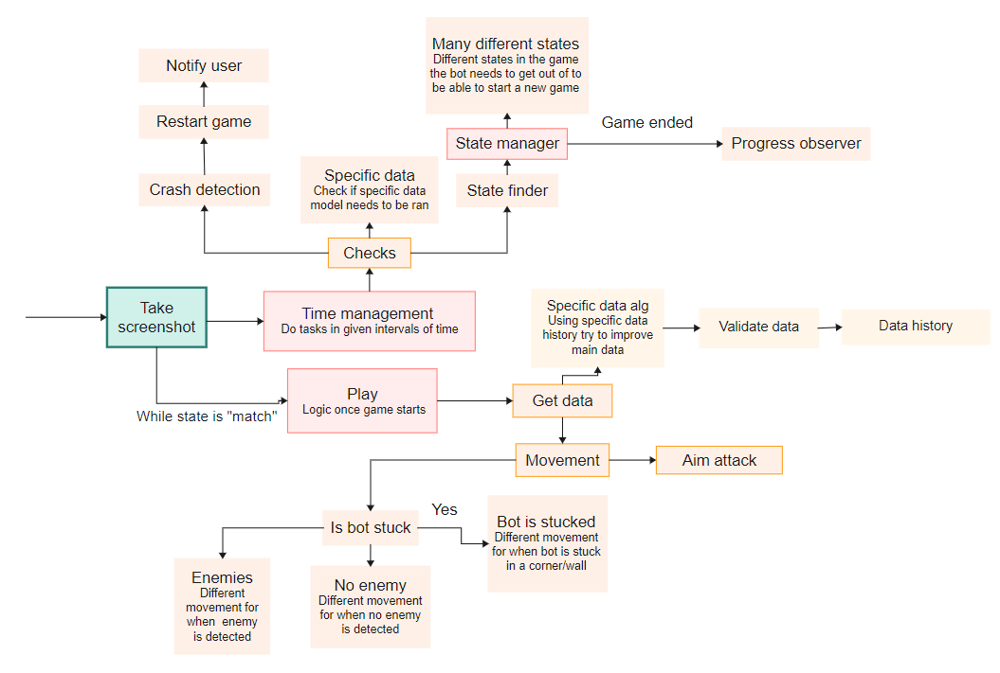

### Important
This documentation aims to give you a rough idea of how the bot works without showing too much code, as it is private, but still giving you enough information to code it yourself.

### Nav
To understand the code in the best way, scroll down in the order provided. For quick access, use the navigation to jump to specific sections.

**Code**
1. [Graph](https://github.com/ivanyordanovgt/brawl-stars-bot/blob/master/Documentation.md#graph) - Graph showing the code logic flow
2. [State finder](https://github.com/ivanyordanovgt/brawl-stars-bot/blob/master/Documentation.md#state-finder) - Identify the current game state
3. [State manager](https://github.com/ivanyordanovgt/brawl-stars-bot/blob/master/Documentation.md#state-Manager) - Automates actions based on the current game state.
4. [Progress Observer](https://github.com/ivanyordanovgt/brawl-stars-bot/blob/master/Documentation.md#progress-observer) - Keep track of the progress after each game to be able to swap brawlers once specific goal is reached.
5. [Lobby automator](https://github.com/ivanyordanovgt/brawl-stars-bot/blob/master/Documentation.md#lobby-automator) -  Automate more complicated actions inside the lobby
6. [Detect](https://github.com/ivanyordanovgt/brawl-stars-bot/blob/master/Documentation.md#detect) - ransform YOLOv8 output into a easier to use format
7. [Movement](https://github.com/ivanyordanovgt/brawl-stars-bot/blob/master/Documentation.md#movement) = Find the best movement with the detected data
8. [Play](https://github.com/ivanyordanovgt/brawl-stars-bot/blob/master/Documentation.md#play) - Main playing logic. Inherits Movement and adds extra functionality
9. [Time Management](https://github.com/ivanyordanovgt/brawl-stars-bot/blob/master/Documentation.md#time-management) - This class helps in determining whether specific time thresholds have been reached for various activities or states, ensuring that actions are taken at appropriate intervals.
10. [Main](https://github.com/ivanyordanovgt/brawl-stars-bot/blob/master/Documentation.md#Main) - he Main class is the core part of the application. It initializes all classes, loads the models, and controls how everything works together. It starts the program, manages tasks, and ensures all parts communicate properly.
11. [Screenshot Taker](https://github.com/ivanyordanovgt/brawl-stars-bot/blob/master/Documentation.md#screenshot-taker)

## Goal
Help new players progress fast enough before they quit the game due to low-level brawlers making them lose every game.<br><br>
If you haven't played B.S., let me explain you the issue.<br>
<br>
Each brawler has these 2 stats. Health and attack. <br>
Level 1 -> 9, 3090 coins<br>
Level 9 -> 11, 4675 coins<br>
Not including star powers, gadgets and hyper charges just to show how hard it is to progerss<br>

As a ***Free to play*** player you can get around 12k coins a month. Your options are:<br>
- 1.5 lvl 11 brawlers per month
- 3.8 lvl 9 brawlers per month

There are currently 82 brawlers. So ***21 months*** of playing everyday to max all. <br>
Brawlers under lvl 9 are close to unplayable. So to have the most fun, most players will choose to have as many lvl 9 brawlers as possible.<br>
### The issue
Power 11 brawlers have ***40% advantage*** over power 9 brawlers. <br>If you are good enough you will still win low-mid skill matches. Once you reach high ladder/rank, that won't be the case anymore.


# How it works
## Graph
This graph roughly illustrates the bot's logic flow.
<br>

## Code
Detailed descriptions of all bot components.
### State finder
**Purpose**: Identify the current game state<br>
**Used in**: State Manager<br><br>
**How it works**:<br>
It uses template matching to compare parts of the screen to predefined images to identify specific game states. This method is quick and efficient because the lobby layout is static and rarely changes. Let's see an example. <br><br>
<br>

This is how the lobby looks after a game is over, and it hasn't changed in years. So we can find the state is 'end_game_lobby' by looking for the red thumbs down button.<br>
```py
def is_in_end_of_a_match(image):
    return is_template_in_region(image, path + 'thumbs_down.png', region_data['thumbs_down'])
def get_in_game_state(image):
    if is_in_end_of_a_match(image): return "end"
    # Checks for other states
```
All regions are inside ```lobby.toml``` to ensure flexability for users.

### State Manager
**Purpose**: Automates actions based on the current game state.<br>
**Used by**: Main<br>

**How it works**:<br>
It has a function for each state. The goal is, no matter which part of the game the bot is currently in, to return to the lobby so it can start another game. It uses a dictionary to map each state to its corresponding function:
```py
def __init__(self, screenshot_taker, brawlers_data):
    self.states = {
                ...,
                'shop': self.quit_shop,
                'brawler_selection': self.quit_shop,
                'popup': self.close_pop_up,
                'end': self.end_game,
            }
    ...
def do_state(self, state, data=None):
    if data:
        self.states[state](data)
        return
    self.states[state]()
```
Let's continue the example from State Finder and see how it ends the game once it knows the state
```py
def end_game(self):
    screenshot = self.Screenshot.take()
    found_game_result = False
    while get_state(screenshot) == "end":
        if not found_game_result:
            # will return True if game result is found and it will update the progress points 
            found_game_result = self.Trophy_observer.find_game_result(screenshot)
        pyautogui.press("q")
        time.sleep(3)
        screenshot = self.Screenshot.take()
```
It screenshots and checks the state until it's outside the end lobby. 
The 'q' key is positioned inside the emulator to press the buttons needed to exit the end lobby.

### Progress Observer
**Purpose**: Keep track of the progress after each game to be able to swap brawlers once specific goal is reached.<br>
**Used in**: Main, State Manager<br><br>
**How it works**:<br>
Uses EasyOCR to read text from the top left corner of the end lobby. The text is then matched to the closest possible result, and if the match is good enough, progression is updated.
```py 
def find_game_result(self, screenshot):
    screenshot = screenshot.crop(self.crop_region)
    array_screenshot = np.array(screenshot)
    result = self.reader.readtext(array_screenshot)
    
    _, text, conf = result[0]
    game_result, ratio = self.closest_match(text)
    if ratio < 0.5:
        print("Couldn't find game result")
        return False
    
    self.add_trophies(game_result)
    self.add_mastery(game_result)
    return True
```
You can remind yourself how the end lobby looks like in the examples above.

### Lobby automator
**Purpose**: Automate more complicated actions inside the lobby<br>
**Used in**: State Manager<br>

**How it works**:<br>
This class currently has one function, ```select_brawler(self, brawler)```. Plans for expanding it are ad related like joining clubs to send messages.<br>
Let's see how it works<br>

In the brawlers menu in each box on the bottom right corner we can see the name of the brawler<br>
<br>
The logic is to take a screenshot, downscale to 65%, use EasyOCR for text detection, if the brawler name is not found, scroll down and repeat until it's found. I trained a model at first to recognize the brawlers, gaining 10x the performance; however, I decided that a 3-4 minute loss per 8-hour session is not worth maintaining such a model with the new brawlers.

### Detect
**Purpose:** Transform YOLOv8 output into a easier to use format<br>
**Used in:** Play<br><br>
**How it works:**<br>
This class is designed to work with a YOLOv8 model. It requires a classes parameter because, when models are exported, they lose their ```names``` attribute, which contains class names and IDs.

The ```detect_objects``` method processes the output from the YOLOv8 model, extracting only the needed data for the bot.

```py
class Detect:

    def __init__(self, model, ignore_classes=None, classes=None):
        self.model = model
        self.classes = classes
        self.ignore_classes = ignore_classes if ignore_classes else []

    def detect_objects(self, img):

        results = self.model(img, conf=0.6, device="cpu", verbose=False)
        detections = {}
        for result in results:
            for box in result.boxes:
                x1, y1, x2, y2 = [int(x) for x in box.xyxy.tolist()[0]]
                class_id = int(box.cls.tolist()[0])
                class_name = self.classes[class_id]

                # Classes can be ignored by both class name and id
                if class_id in self.ignore_classes or class_name in self.ignore_classes:
                    continue
                    
                if class_name not in detections.keys():
                    detections[class_name] = []
                detections[class_name].append([x1, y1, x2, y2])
        return detections
```
Example usage:
```py
self.Detect_main_info = Detect(main_info_model, classes=['enemy', 'player', 'teammate'])
self.Detect_main_info.detect_objects(frame)
```

### Movement
**Purpose:** Find the best movement with the detected data<br>
**Used in:** Play

**How it works:**<br> 
Main method called ```def get_movement():``` accepts the params ```player_data, enemy_data, safe_range, attack_range, walls```<br>
Movement logic is separated in two: When enemies are found and when they are not.
```py
if enemy_data is None:
    return self.no_enemy_movement(player_data, walls)
```
When ***no enemy*** is found the logic is the following: <br>
1. Check if there is an wall in front of the player
2. If there ***is not*** just go forward<br>
3. If there ***is*** calculate the closest edge and go around it. <br>

```py
def no_enemy_movement(self, player_data, walls):
    player_pos_x = (player_data[0] + player_data[2]) / 2
    player_pos_y = (player_data[1] + player_data[3]) / 2
    player_position = (player_pos_x, player_pos_y)
    wall = self.wall_in_front(player_position, walls)

    if not wall:
        return "W" # No wall in front, move forward
    x1, y1, x2, y2 = wall
    # Decide the movement based on the closest edge
    if abs(x1 - player_pos_x) < abs(x2 - player_pos_x):
        return "WA"  # Wall closer to the right, move top-left
    return "WD" # Wall closer to the left, move top-right
```

When there are enemies detected, there are more steps to determine the best movement. Since there will often be more than one enemy, the logic begins with prioritizing which enemy is the most dangerous one.<br>
```py
enemy_coords, enemy_distance, enemy_range = self.prio_enemy(enemy_data, [player_pos_x, player_pos_y], walls)
```
The ```prio_enemy()``` works the following way:
1. If specific model succesfully found what the brawlers are:<br> 
   - Target the one which attack range is the closest to hitting the player
2. If no data about what brawlers:
    - Target the closest one which is hittable (not behind a wall)
    - If no enemies are hittable target the one which is the closest if he teleported to the closer edge of the wall he is behind

When an enemy is selected we are in the end phase. We need to determine if the bot needs to go towards the enemy or run away. 
```py
safe_range = enemy_range if enemy_range else safe_range
if enemy_distance > safe_range:  # Move towards the enemy
    move_horizontal = "D" if direction_x > 0 else "A"
    move_vertical = "S" if direction_y > 0 else "W"
    state = "towards"
else:  # Move away from the enemy
    move_horizontal = "A" if direction_x > 0 else "D"
    move_vertical = "W" if direction_y > 0 else "S"
    state = "escape"
```

There is a lot more to the ```Movement class```, for example, if an enemy is outside the safe range but in the attack range, the bot will move randomly to potentially dodge any attacks but this is the main logic..

### Play
**Purpose:** Main playing logic. Inherits Movement and adds extra functionality<br> 
**Used in:** Main

**How it works:**<br>
For this one, let's jump straight into the code.<br>
```py
 def main(self, frame, brawler):
     current_time = time.time()
     data = self.validate_game_data(self.get_main_data(frame))
     self.track_no_detections(data)
     if data is False:
         self.time_since_movement_change = time.time()
         for key in self.keys_hold:
             pyautogui.keyUp(key)
         self.keys_hold = []
         return

     safe_range, attack_range = self.brawler_ranges[brawler]
     self.attack(data, safe_range, attack_range)
     movement, distance, state = self.get_movement(data, safe_range, attack_range)
     
     
     movement = self.validate_movement(movement, current_time)
     if current_time - self.time_since_movement > 0.5:
         self.do_movement(movement)
```
The logic begins with getting the data from the game which is then validated. The validation will either return:
1. ```False``` if the data is unsuable
2. Original data with or without minor adjustments like adding missing keys

```self.track_no_detections(data)``` - Updates the history of the detections. This history is used by ```State Manager``` to determine if a crash has happened.

If the data is unusable the bot will no longer function untill usable data is found again.


After it's confirmed the data is good enough for playing it's time to check if the bot should attack. 
```py
self.attack(data, safe_range, attack_range)
```
The logic for the attack is rather simple: if the enemy is within range and the attack's path is not going through a wall, press 'a,' which is a keybind in the emulator for an attack.

And finally, the end. Picking the movement which works using ```Movement```'s main method.
```
movement, distance, state = self.get_movement(data, safe_range, attack_range)
```
You might be confused about this part:
```py
  if current_time - self.time_since_movement > 0.5:
      self.do_movement(movement)
```
The movement changes every 0.5s instead of every iteration because: 
1. The bot can get stuck in a loop of going forward and backwards 
2. Constant 5-15 changes of movement per second becomes unhuman like and can result in an script detection
3. Ensures smoother playing as the bot commits more into it's descisions and doesn't react instantly like a human would.

### Time Management
**Purpose:** This class helps in determining whether specific time thresholds have been reached for various activities or states, ensuring that actions are taken at appropriate intervals.<br>
**Used in:** Main

**How it works:**<br>
It keeps a record of the last time each action happened and checks if enough time has passed to perform the action again. If the time threshold is met, it updates the record to the current time.

Example:
```py
 def check_time(self, check_type):
     current_time = time.time()
     if (current_time - self.states[check_type]) >= self.thresholds[check_type]:
         self.states[check_type] = current_time  # Reset the timer right after checking
         return True
     return False

 def state_check(self):
     return self.check_time('state_check')

```

If we want to know if it's time to check for the state of the game we will call ```state_check```

### Main
**Purpose:** The Main class is the core part of the application. It initializes all classes, loads the models, and controls how everything works together. It starts the program, manages tasks, and ensures all parts communicate properly.

**How it works**:<br>
For this one, let's jump straight into the code. The Main class has a lot of methods which are called inside ```__init__```, we are not going to look at them but at the ``main`` method.

```py
 def main(self):
     while True:
         frame = self.Screenshot.take()
         self.manage_time_tasks(frame)

         if self.Time_management.specific_brawlers_check():
             self.Play.get_specific_data(frame)

         brawler = self.Stage_manager.brawlers_pick_data[0]['brawler']
         self.Play.main(frame, brawler)
```

```self.manage_time_tasks(frame)``` Handles the logic around ```Time Management``` class:
```py
 def manage_time_tasks(self, frame):
     if self.Time_management.state_check():
         state = get_state(frame)
         data = frame if state in self.states_requiring_data else None
         self.Stage_manager.do_state(state, data)

     if self.Time_management.no_detections_check():
         data = self.Play.time_since_detections
         for key, value in data.items():
             if time.time() - value > self.no_detections_action_threshold:
                 self.restart_brawl_stars()

     if self.Time_management.idle_check():
         self.lobby_automator.check_for_idle(frame)

    if ...
    if ...
```
It simply checks if it's time for the given check and if  it is, it calls it.

This part might confuse you:
```py
if self.Time_management.specific_brawlers_check():
   self.Play.get_specific_data(frame)
```
**What does it do** <br>
Brawl Stars is a very dynamic game. Detecting specific brawlers, instead of just enemies, can be unreliable but useful. Instead of using two models simultaneously, which slows the bot by 48%, it's better to use the specific brawler model 1-3 times a second. This works because a third model detects brawlers at the start screen, ensuring it's known what brawlers to expect. If the data is correct, it can be saved and used to estimate the enemy's brawler by their positions.

And let's see the final lines of code
```
brawler = self.Stage_manager.brawlers_pick_data[0]['brawler']
self.Play.main(frame, brawler)
```
The bot will play the brawlers in the order the user picked them. Once wanted progression is reached it will pop the first element in the data list and continue until the list is empty. The data looks like this:<br>
```py
[
    {'brawler': 'piper', 'push_until': 650, 'trophies': 514, 'mastery': 3054, 'type': 'trophies'},
    {'brawler': '8bit', 'push_until': 11150, 'trophies': 400, 'mastery': 10032, 'type': 'mastery'}
]
```
### Screenshot Taker
**Purpose:** Return an image of the screen in PIL format<br>
**Used in:** LobbyAutomation, Main

**How it works**:<br>
Initiliases with an "camera" object which comes from the library "DXCam". Sometimes "DXCam" returns None images which breaks the code. ``take`` ensures the image cannot be ``None``
```py
class ScreenshotTaker:

    def __init__(self, camera):
        self.camera = camera

    def take(self):
        image = self.camera.grab()
        while image is None:
            image = self.camera.grab()

        image = Image.fromarray(image)
        return image
```
