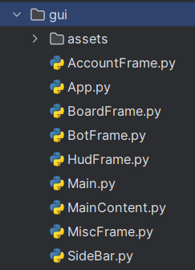

## GUI

### Main app
This is the main app for the bot. It is currently not used as a lot of 
functionality of the bot have been changed as the first 
version didn't use A.I.. However I am a fan of the design and will
integrate the new version into it.

**Showcase:**

**How it works**:<br>



The app is seperated into class based views. <br>
`Main` class connects the SideBar (nav) with the rest of the views.<br>
```py
class Main(SideBar, MainContent):
    def __init__(self):
        super().__init__()
        self.redirect_on_login = False

    def SidebarNav(self):
        self.place_side_bar()

    def CreateFrames(self):
        self.place_main_content()

    def MainContent(self):
        self.place_main_content()
```

Let's look at the `SideBar` class to understand why this is a convenient <br>

```py
class SideBar(App):
    def __init__(self):
        super().__init__()
        self.create_widgets()
        
    def create_widgets(self):
        ...

    def place_side_bar(self):
        ...

    def focus_on_btn(self, btn_name):
       ...

        views = {
            'bot': self.bot_frame,
            'brawler': self.board_frame,
            'hud': self.hud_frame,
            'misc': self.misc_frame,
            'account': self.account_frame
        }
        ...

```

Since `Main` inherits the `SideBar` and `MainContent`, 
`SideBar` has access to all frames because `MainContent` inherits
all views:

```py
class MainContent(BotFrame, BoardFrame, HudFrame, MiscFrame, AccountFrame, App):
    def __init__(self):
        super().__init__()

    def place_main_content(self):
        ...
```

The method `place_main_content` initializes all views and hides them from being visible so they can be swap through instantly.

### Temporary app

**Showcase:**

**How it works:**<br>


This app is a lot simpler. 

**api.py**:<br>
Contains all logic for calling the backend api

**login.py**<br>
Simple window with an input and submit button which checks if the user's key is valid

**select_brawler.py**:<br>
What the user sees once logged in. In this menu the user selects the brawlers the bot will play

**main.py**<br>
Combines all components