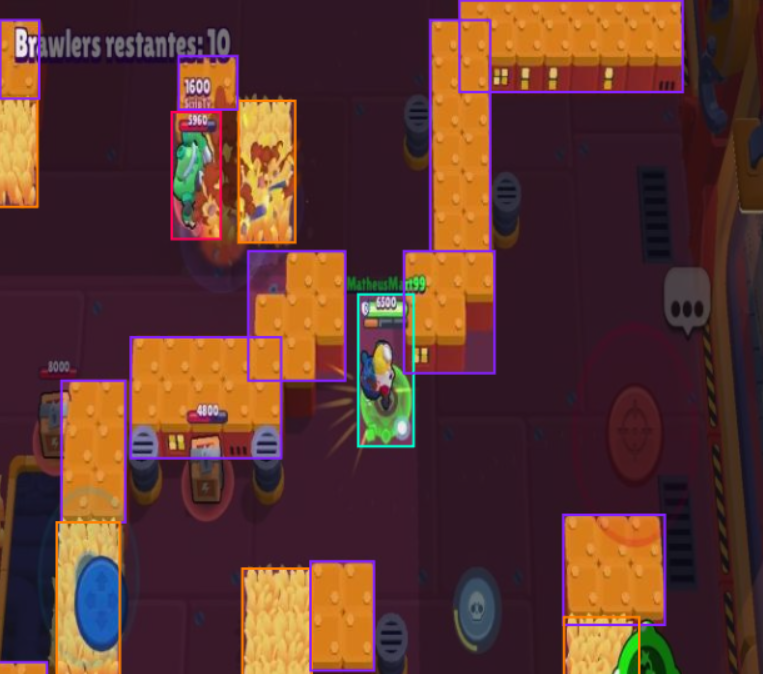

## Models

### Specific in-game data
https://github.com/user-attachments/assets/aa2deb28-e6df-4ece-a3df-cbde8cb5ce6a

### Main in-game data
**Detects:** Ally, Enemy, Player, Walls, Bushes  
**Reliability:** Very high 
**Maintenance:** Very low

**What it does:** 
Detects main in-game data. 

