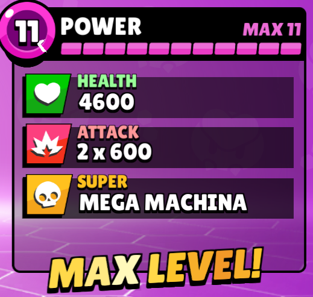

## Goal
Help new players progress fast enough before they quit the game due to low-level brawlers making them lose every game.  
If you haven't played B.S., let me explain you the issue. 
 
Each brawler has these 2 stats. Health and attack.  
Level 1 -> 9, 3090 coins 
Level 9 -> 11, 4675 coins 
Not including star powers, gadgets and hyper charges just to show how hard it is to progerss 

As a ***Free to play*** player you can get around 12k coins a month. Your options are: 
- 1.5 lvl 11 brawlers per month
- 3.8 lvl 9 brawlers per month

There are currently 82 brawlers. So ***21 months*** of playing everyday to max all.  
Brawlers under lvl 9 are close to unplayable. So to have the most fun, most players will choose to have as many lvl 9 brawlers as possible. 
### The issue
Power 11 brawlers have ***40% advantage*** over power 9 brawlers.  If you are good enough you will still win low-mid skill matches. Once you reach high ladder/rank, that won't be the case anymore.
