## Models

### Specific in-game data
**Detects:** 79 brawlers + 750 skins + each skin/brawler abilities + 5 types of balls + gems + power cubes + poison clouds + walls + bushes<br>
**Reliability:** 5.5/10<br>
**Maintenance:** Very high <br>

https://github.com/user-attachments/assets/aa2deb28-e6df-4ece-a3df-cbde8cb5ce6a

**How was it trained:**<br>
The assets were 
### 2,835,000 images!
And the dataset was **250k** images. 

**Why so much?:**<br>
Let's look at a brawler:<br>
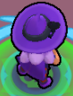
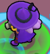
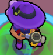
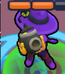<br>
Each brawler has around 40 angles from which you can see them, plus extra angles when shooting, and extra angles while moving and shooting. This quickly stacks up.

**How did I manage to get all the assets:**<br>
There are no assets for this online so I had to the following:
1. Code a script which goes into a game and makes screenshots of each angle of the brawler.
2. Train a model to crop out the brawler from the image
3. Train a model to segment the brawler out of the image
4. Get other in-game assets - ***Will skip this*** as it's just me manually going over every single map and becoming a Photoshop dev
4. Build a dataset generator with the assets

Let's begin explaining each one!

**1. Script for screenshotting**:<br>
In the game there is an ```Skin catalog``` which lets us try every skin in the game for free.
It looks like this:
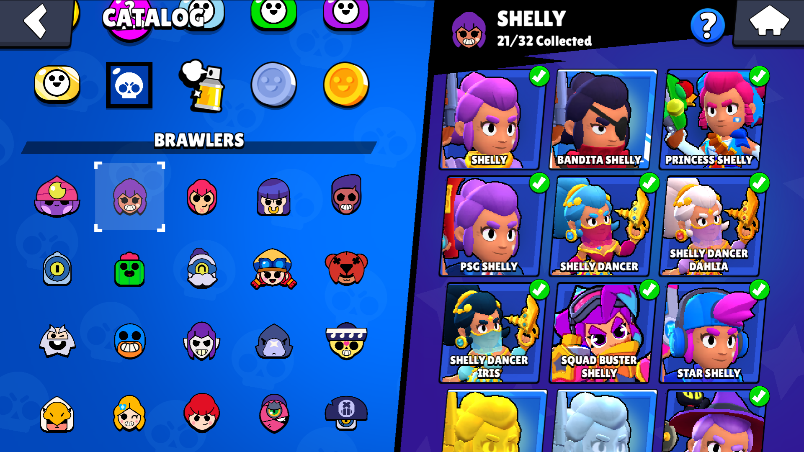<br>
The brawlers are in rows of 6 and the skins in rows of 3. <br>
***1.1 The logic***:<br>
On emulators, we can set a keybind to be at a specific position and when pressed, it clicks. 
The keybinds ```zxcvb``` were placed on top of each
brawler in the first row of brawlers and ``asd`` on the first skins in the first row. 
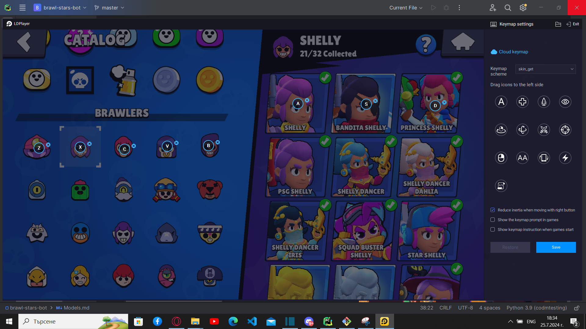<br>
Then a simple python algorithm goes thru all skins and rows. <br>
When in a game the logic is the following:
1. Shoot in all possible angles so the character looks this way after the shooting animation is over.
2. Screenshot before shooting, while shooting, after shooting
3. Crop only the brawler using AEP model. (Main in-game model)
4. After all angles are covered, repeat 1., 2., and 3. while the character is moving ```Forwards, Backwards, Diagonally each side```.

Now we have images of all brawlers which look like this:<br>
<br>

**2. Model to crop the brawlers**<br>
There is specific section for this model. [Click to navigate to it](https://github.com/ivanyordanovgt/brawl-stars-bot/blob/master/Models.md#main-in-game-data)

**3. Segment the images**<br>
First i tried using a popular tool called ```rembg```. Results were looking like this:<br>
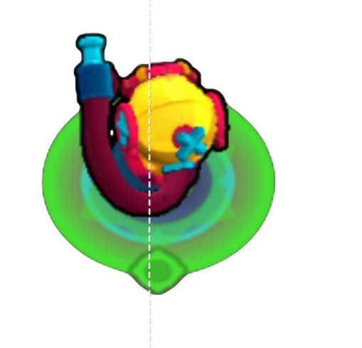<br>
Which was useful because the less complicated the object I need to crop out is, the better.<br>
To train a model to crop out the brawler without a circle, I decided it's best to manually annotate some images and see if it works because if it does, I will save a lot of time.<br>
I tried 50, 100, 150 and on 200 annotated images the results were perfect. Annotating looks like this:<br>

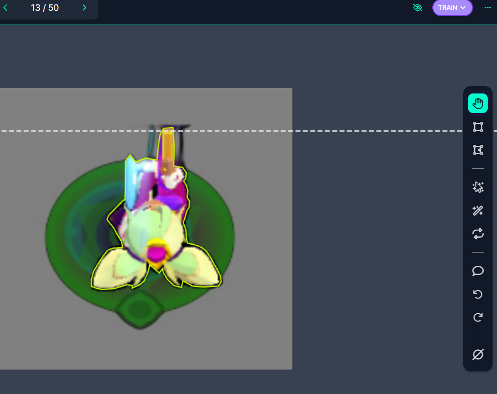

I used [roboflow](roboflow.ai).

Now that the model is ready, it was time to segment all images. ***It took some time*** but the result was the following for each brawler:<br>
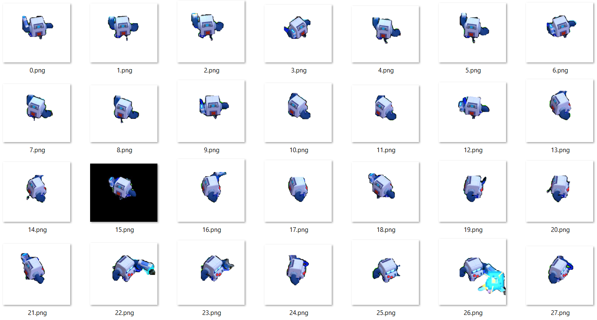

**4. Dataset Generator**<br>
This part has a lot of details to it, so it will be put into a separate [section].(https://github.com/ivanyordanovgt/brawl-stars-bot/blob/master/Models.md#4.Dataset-Generator)

**5. Training process:**<br>
The model was trained for 150 epochs on a 250k dataset on a rented RTX 4090. It cost around $45 USD.
### Dataset Generator
The generator is split into the following classes

**1. NameGenerator:**<br>
Generates an random username with B.S.'s font.<br><br>


**2. LoadData**<br>
Loads all data

**3. RandomEngine**<br>
Picks the random assets / positions for the generation of example.

**4. ObstacleEngine**<br>
Generates shapes of obstacles<br>
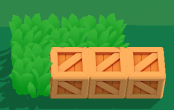

**5. Annotator**<br>
Creates an .txt annotation file with the generated example in YOLOv8 format

**6. Generate**<br>
Main class, connects all classes above and generates a new example.

### Start screen 
**Detects:** All brawlers with all possible skins in start screen<br>
**Reliability:** 10/10<br>
**Maintenance:** Medium

**What it does:**<br>
Detects brawlers in starting screen with all possible skins.
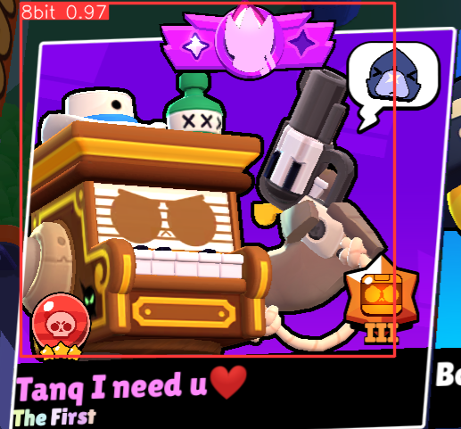<br>
There are 6 boxes in the start always in the same position so they are cropped out and given to the model.
<br>
The training process was identical as ```Specific in-game data``` model but required a lot less data as the objects are close to static.

### Brawler Selection
**Detects:** All brawlers in brawler selection<br>
**Reliability:** 10/10<br>
**Maintenance:**: Very low

**What it does:**<br>
Detects brawlers in `brawlers selection menu`.<br>
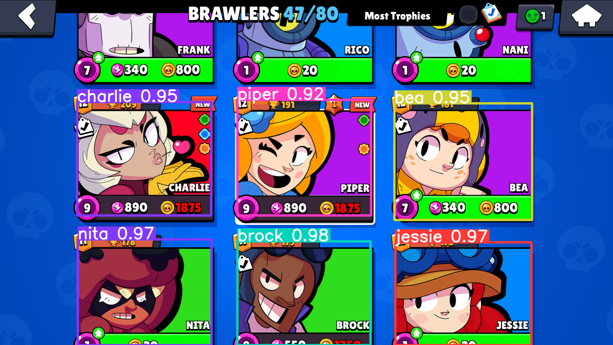
This model is not used however because it's easier to use an OCR and look for the text in the boxes.

### Main in-game data
**Detects:** Ally, Enemy, Player, Walls, Bushes <br>
**Reliability:** 8.5/10<br>
**Maintenance:** Very low

**What it does:**<br>
Detects main in-game data. 
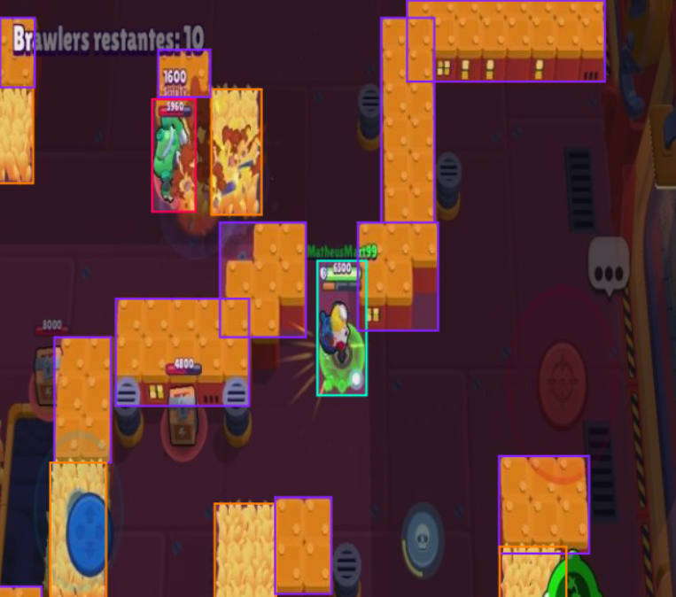

